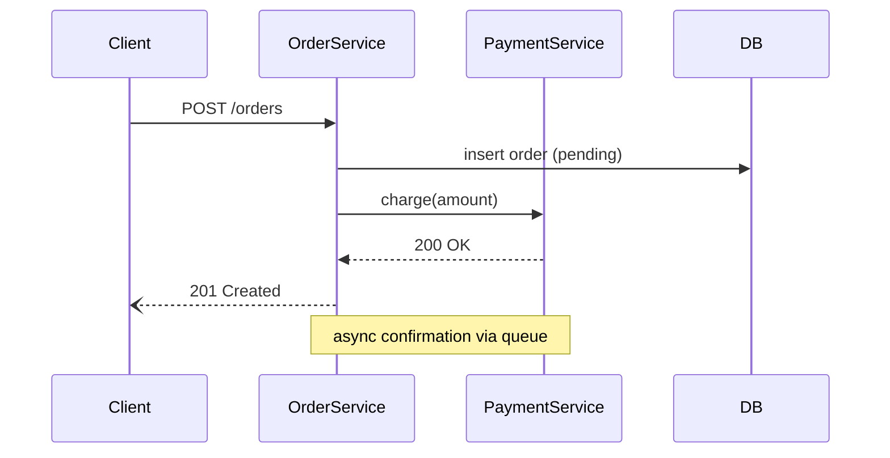
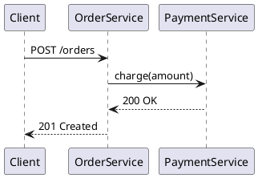

# Sequence Diagram

## Overview

Turns a microservice's real interactions — from its source code and/or a
described scenario — into a sequence diagram (Mermaid or PlantUML). The
hard part isn't syntax, it's picking the right participants and the right
level of detail: diagram process boundaries, not function calls.

## When to Use

- "Draw/build a sequence diagram for service X"
- "Show how service A talks to B when a user does Y"
- Explaining or documenting an API call flow, webhook flow, or event flow

**Not for:** class diagrams, ER diagrams, or diagramming internal
function calls within a single process (that's a call graph, not a
sequence diagram).

## Process

0. **Match the user's language.** Ask every clarifying question, AND write
   the diagram itself, in the language the user has been writing in — not
   English by default. This includes participant labels and message text
   in the Mermaid/PlantUML source (e.g. `Клиент`, `оформить заказ`), and any
   surrounding chat explanation. Keep only things that are literally code —
   endpoint paths, method/class names, field names — verbatim; translate
   everything else.

1. **Establish scope from what the user actually asked.**
   - If they already named a specific endpoint, consumer, job, or scenario,
     diagram just that one flow — no need to ask.
   - Otherwise ("build a sequence diagram for sdf-service", "diagram this
     service"), ask exactly one clarifying question with two options — don't
     pre-guess a flow from recent commits or add extra choices:
     1. **Whole service** — find every entrypoint (HTTP endpoints,
        consumers, cron/scheduled jobs) and produce **one diagram per
        entrypoint**.
     2. **A specific endpoint** — the user names it, then diagram just that
        flow.

2. **Gather interactions.**
   - **From code:** find the entrypoint (controller/handler/consumer) for
     the chosen flow, then trace outbound calls it makes: HTTP/gRPC
     clients, message publish/consume, DB/cache access. Search for
     language-typical client patterns (`requests`/`httpx`/`fetch`/`axios`,
     `RestTemplate`/`WebClient`, `http.Client`, gRPC stub calls, SDK calls
     to a queue/broker). Use Explore/Grep rather than reading every file.
   - **From a description:** use the user's stated order of calls
     directly. Don't invent steps they didn't mention.
   - If both are available, prefer code as ground truth and use the
     description to pick which flow/branch to follow.

3. **Pick participants — process boundaries only.** Include: the service
   itself, each external service it calls, the DB/cache, the message
   broker, and the original caller if known. Exclude internal
   classes/functions — collapse them into the service that owns them.

4. **Order the interactions**, marking sync vs async, and note error/branch
   paths only if they matter to the flow being documented (e.g. a retry,
   a fallback, a rejected validation) — don't diagram every possible
   exception.

5. **Pick a format** — default to Mermaid. Use PlantUML if the user asks,
   or the project already has `.puml` files.

## Quick Reference

**Mermaid** (fenced ` ```mermaid ` block):

- `->>` sync request, `-->>` sync response, `-)` async/fire-and-forget
- `alt`/`else`/`end` for branches, `Note over A,B: text` for side effects

**PlantUML**:


## Output

- Always show the diagram source as a fenced code block in the reply.
- For Mermaid, also publish it as an Artifact so it renders live —
  load the `artifact-design` skill first, per its own requirement.
- If working inside a repo that contains the diagrammed service's code,
  offer to save the file (e.g. `docs/diagrams/<service>-<flow>-sequence.mmd`
  or `.puml`) — confirm the path before writing, don't save on a one-off
  chat request with no repo context.

## Common Mistakes

| Mistake | Fix |
|---|---|
| Diagramming every function call inside the service | Collapse internals into one participant — only process/network boundaries are actors |
| Merging every endpoint into one giant diagram | One flow per diagram — a whole-service request means one diagram *per entrypoint*, not one mega-diagram |
| Auto-picking a flow from a recent commit instead of asking | For a generic request, ask the whole-service-vs-specific-endpoint question — don't guess a flow from git history |
| Skipping the question and defaulting silently | Always ask when the user didn't name a flow — only skip when they already did |
| Inventing calls not present in code or description | Trace actual outbound calls; don't guess at integrations |
| Showing every possible error branch | Only include branches relevant to the flow being explained |
