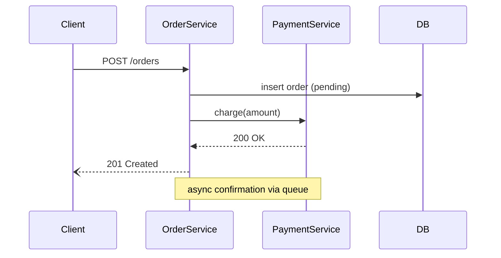
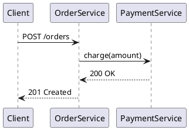

# Sequence Diagram

## Overview

Turns a microservice's real interactions — from its source code and/or a
described scenario — into a sequence diagram (Mermaid or PlantUML). The
hard part isn't syntax, it's picking the right participants and the right
level of detail: diagram process boundaries, not function calls.

## When to Use

- "Draw/build a sequence diagram for service X"
- "Show how service A talks to B when a user does Y"
- Explaining or documenting an API call flow, webhook flow, or event flow

**Not for:** class diagrams, ER diagrams, or diagramming internal
function calls within a single process (that's a call graph, not a
sequence diagram).

## Process

0. **Match the user's language — everywhere, not just the diagram.** Ask
   every clarifying question, write the diagram itself, AND write every bit
   of surrounding text in the language the user has been writing in — not
   English by default. This covers: participant labels and message text in
   the Mermaid/PlantUML source (e.g. `Клиент`, `оформить заказ`); chat
   explanation; and, for an Artifact, *all* of its page text — title,
   intro/description, section headers, navigation labels, table headers,
   button text. There is no "just UI chrome, that can stay English"
   exception — a mixed-language page is the failure mode to avoid. Keep
   only things that are literally code verbatim — endpoint paths,
   method/class/service names, field names; translate everything else.

1. **Establish scope from what the user actually asked.**
   - If they already named a specific endpoint, consumer, job, or scenario,
     diagram just that one flow — no need to ask.
   - Otherwise ("build a sequence diagram for sdf-service", "diagram this
     service"), ask exactly one clarifying question with two options — don't
     pre-guess a flow from recent commits or add extra choices:
     1. **Whole service** — find every entrypoint (HTTP endpoints,
        consumers, cron/scheduled jobs) and produce an **overview diagram**
        (see step 2) plus **one detailed diagram per entrypoint**.
     2. **A specific endpoint** — the user names it, then diagram just that
        flow (skip the overview, go straight to steps 3-6).

2. **Build the overview diagram (whole-service scope only).** A simplified
   service map, not a full sequence: one row per entrypoint, with an arrow
   only to each thing it touches (other services, DB, queue) — no
   request/response pairs, no branches, and no incidental detail. But
   **always name the specific endpoint/route/job an arrow belongs to**
   (e.g. `POST /batches/send: чтение/запись`, not bare `чтение/запись`) —
   when one process participant represents several entrypoints (a service
   with 11 routes, a worker with 6 tick loops), a bare action label makes
   it impossible to trace which entrypoint's logic an arrow belongs to.
   This is the "whole picture" a reader sees first; the detailed per-entrypoint
   diagrams (steps 3-6, run once per entrypoint) are what they drill into.

3. **Gather interactions.**
   - **From code:** find the entrypoint (controller/handler/consumer) for
     the chosen flow, then trace outbound calls it makes: HTTP/gRPC
     clients, message publish/consume, DB/cache access. Search for
     language-typical client patterns (`requests`/`httpx`/`fetch`/`axios`,
     `RestTemplate`/`WebClient`, `http.Client`, gRPC stub calls, SDK calls
     to a queue/broker). Use Explore/Grep rather than reading every file.
   - **From a description:** use the user's stated order of calls
     directly. Don't invent steps they didn't mention.
   - If both are available, prefer code as ground truth and use the
     description to pick which flow/branch to follow.

4. **Pick participants — process boundaries only.** Include: the service
   itself, each external service it calls, the DB/cache, the message
   broker, and the original caller if known. Exclude internal
   classes/functions — collapse them into the service that owns them.

5. **Order the interactions**, marking sync vs async, and note error/branch
   paths only if they matter to the flow being documented (e.g. a retry,
   a fallback, a rejected validation) — don't diagram every possible
   exception.

6. **Pick a format** — default to Mermaid. Use PlantUML if the user asks,
   or the project already has `.puml` files.

## Quick Reference

**Mermaid** (fenced ` ```mermaid ` block):

- `->>` sync request, `-->>` sync response, `-)` async/fire-and-forget
- `alt`/`else`/`end` for branches, `Note over A,B: text` for side effects

**PlantUML**:


## Output

**Readability over fitting a box.** Never let Mermaid shrink a diagram to
fit a fixed-width card — with 6+ participants that makes labels and arrow
text unreadable. Render at natural size (`mermaid.render` output, no CSS
`max-width`/`transform: scale` squeeze) and let the container scroll
horizontally; for the overview diagram in particular, give it the full
page width rather than sharing a narrow column with sidebar/nav.

**Single flow** (a named endpoint, or after drilling into one from a
whole-service set):
- Always show the diagram source as a fenced code block in the reply.
- For Mermaid, also publish it as an Artifact so it renders live —
  load the `artifact-design` skill first, per its own requirement.
- If working inside a repo that contains the diagrammed service's code,
  offer to save the file (e.g. `docs/diagrams/<service>/<endpoint>.mmd`
  or `.puml`) — confirm the path before writing, don't save on a one-off
  chat request with no repo context.

**Whole service** (overview + one diagram per entrypoint):
- **Artifact:** publish one interactive page — the overview renders first;
  clicking an entrypoint in it swaps the view to that entrypoint's detailed
  diagram (client-side view switch, no page reload, no new Artifact per
  endpoint). Load `artifact-design` and `artifact-capabilities` first.
- **Saved files:** `docs/diagrams/<service>/overview.mmd` (or `.puml`) plus
  one file per entrypoint (`docs/diagrams/<service>/<endpoint>.mmd`), and a
  `docs/diagrams/<service>/README.md` that links the overview to each
  detailed diagram with plain markdown links — this is what makes drilling
  in work on GitHub/GitLab, which don't support `click` on Mermaid
  sequence diagrams.
- Still show the overview diagram source as a fenced code block in the
  reply; don't dump every per-entrypoint source inline too — link to the
  Artifact and/or saved files instead.

## Common Mistakes

| Mistake | Fix |
|---|---|
| Diagramming every function call inside the service | Collapse internals into one participant — only process/network boundaries are actors |
| Merging every endpoint into one giant diagram | One flow per diagram — a whole-service request means an overview *plus* one diagram per entrypoint, not one mega-diagram |
| Whole-service output with no overview, or overview with full message detail | Overview = simplified service map only (who calls what); message-level detail belongs in the per-entrypoint diagrams |
| Auto-picking a flow from a recent commit instead of asking | For a generic request, ask the whole-service-vs-specific-endpoint question — don't guess a flow from git history |
| Skipping the question and defaulting silently | Always ask when the user didn't name a flow — only skip when they already did |
| Inventing calls not present in code or description | Trace actual outbound calls; don't guess at integrations |
| Showing every possible error branch | Only include branches relevant to the flow being explained |
| Translating the diagram but leaving Artifact titles/intro/nav in English | Language-match the *entire* page, not just the diagram content |
| Diagram squeezed into a narrow card, text unreadable | Render at natural size with horizontal scroll — never scale down to fit |
| Overview arrow labeled with a bare action ("чтение/запись") when the participant has multiple routes/jobs | Name the specific endpoint/route/job on the arrow so one entrypoint's path can be traced |
